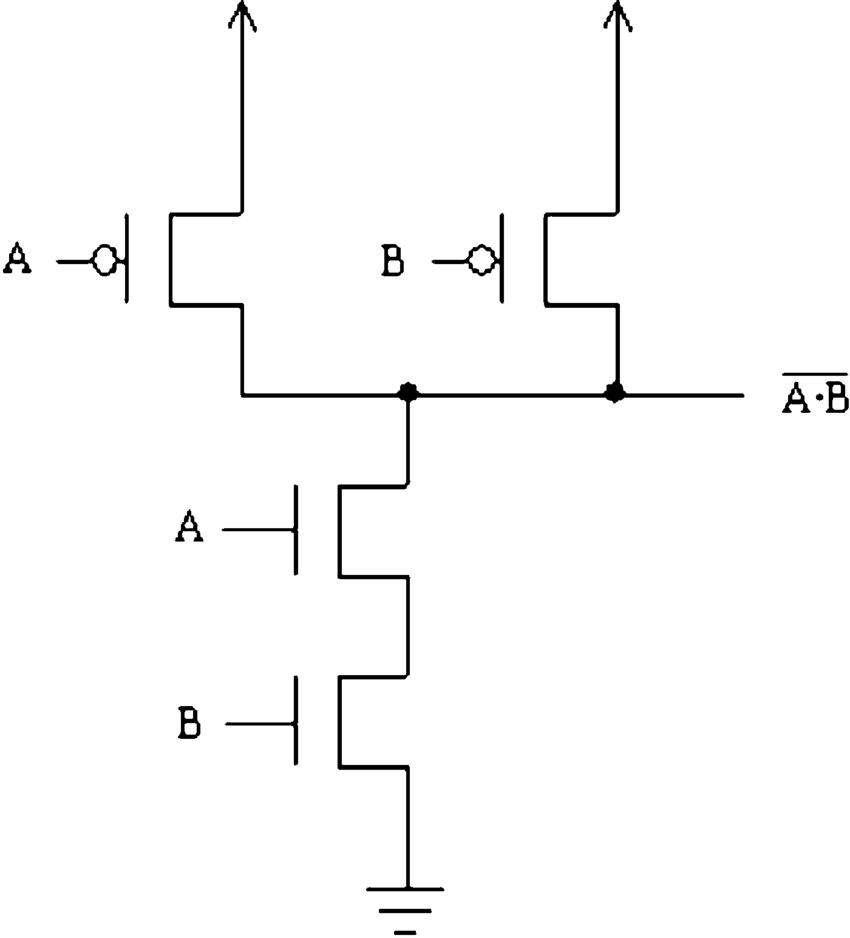

# Dadda Multiplier - Verilog HDL Project

## ⚡ Description
This project implements a high-speed **Dadda Multiplier** using Verilog HDL. It is optimized for area and delay using Dadda’s reduction technique.

## 📂 File Structure
- `/src/dadda_multiplier.v` → RTL Code
- `/tb/dadda_tb.v` → Testbench
- `/waveform/simulation_waveform.png` → Simulation output (e.g., from ModelSim)

## 🔧 Tools Used
- ModelSim / Vivado / Cadence NC-Sim (your tool name)
- Verilog HDL

## 📈 Output

## 👨‍💻 Developer
**Rohith Kumar**  
B.Tech – ECE  
Bonam Venkata Chalamayya Engineering College  
